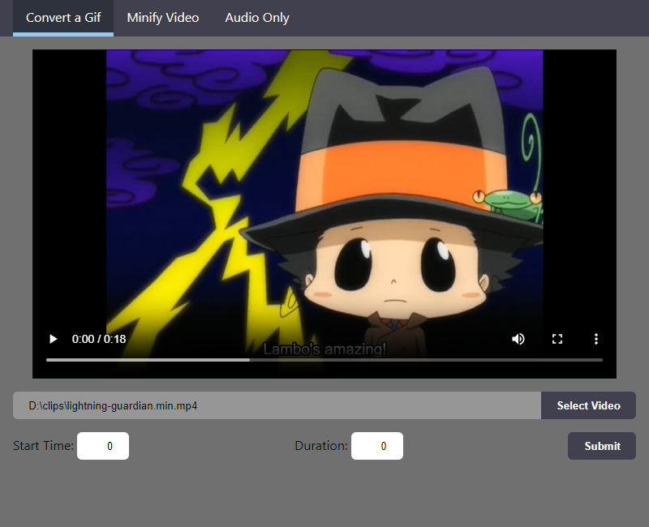
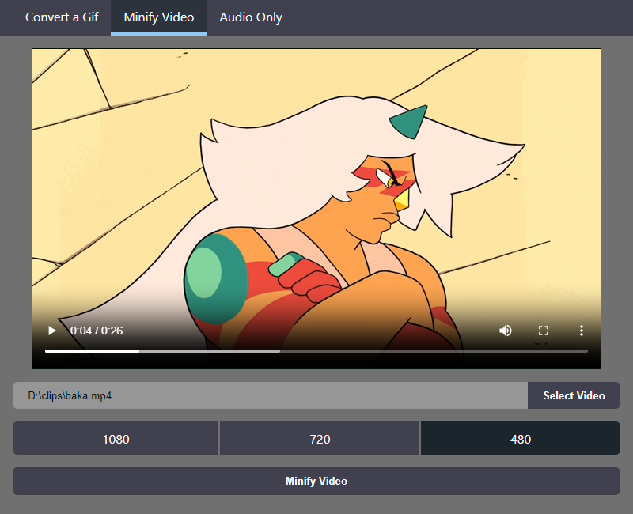
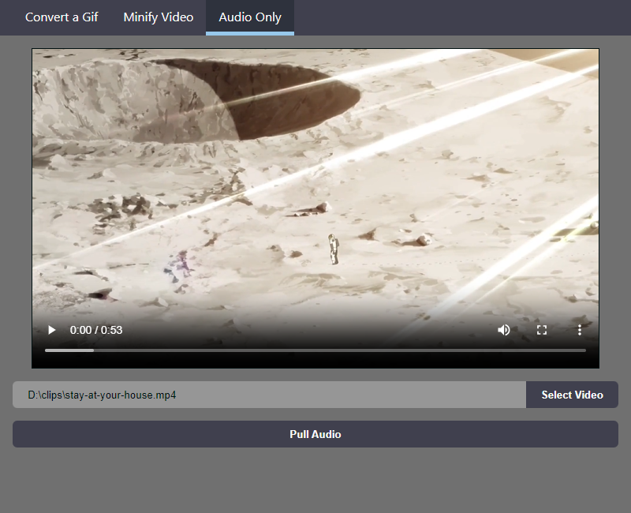

# Screenshots

<div style="display: flex; justify-content: space-between">
    
    
    
</div>

# Features

-   Converts a section of a video file into a Gif
-   Reduces the Resolution of a video file
-   Creates an .mp3 from a video file

# Development

**Tools**: Tauri, Qwik, Rust, vite

Setup:

```shell
git clone https://github.com/davidc4747/ff-tools
cd ff-tools/
npm install
npm run start
```
